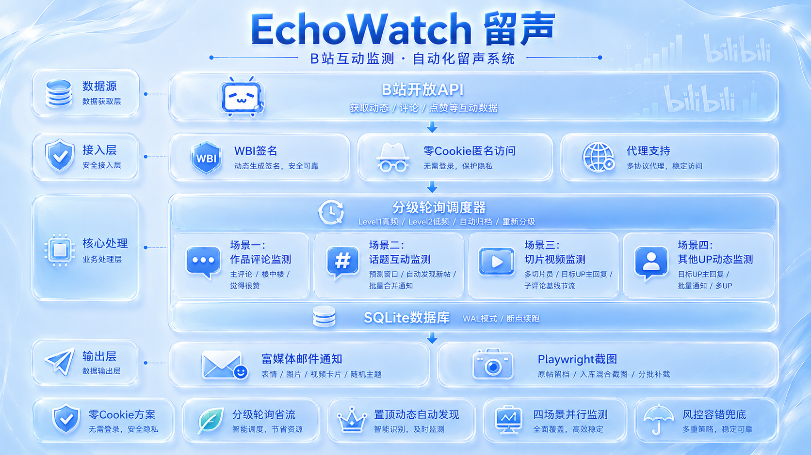

# EchoWatch（留声）v1.8.0

B站 UP主 互动监测系统 —— 实时发现 UP主 在评论区中的互动行为，通过邮件推送通知。

> 留住UP主的真心与回响

## 功能

### 场景一：自身作品监测
- 监测 UP主 自己发布的动态、视频、专栏评论区
- 捕获 UP主 亲自发的评论和回复（含楼中楼子评论）
- 捕获被标注"UP觉得很赞"的评论
- 支持优先监测列表（如置顶动态），**自动发现 API 置顶并跟踪变更**，始终高频轮询

### 场景二：话题互动监测
- 监测指定话题下粉丝帖子中 UP主 的互动
- 两阶段轮询：话题列表发现 → 评论区轮询
- 预测窗口机制：根据 UP主 互动规律优化轮询频率


### 场景三：切片视频评论区监测
- 配置多个切片UP主（切片员），监测其投稿视频评论区中目标UP主的评论/回复
- 切片员昵称启动时自动获取，config 只需填 UID
- 入库截图暂缓，由补截循环分批补齐（首次大量入库不阻塞）

### 通知方式

| 互动类型 | 即时 | 批量 | 22:00 日报 |
|---------|------|------|-----------|
| Priority 主评论 | 一条一封 | - | 也汇总 |
| Priority 子评论 | - | 每 3 分钟合并一封（复用场景二模板） | 也汇总 |
| 普通场景一互动 | 一条一封（30s 队列） | - | 也汇总 |
| 场景二互动 | - | 每 3 分钟合并一封 | 也汇总 |
| 场景三互动 | - | 每 3 分钟合并一封 | 也汇总 |

- 日报是每天的最后一道全量汇总，**包含所有已即时/已批量发送过的互动**，不遗漏
- Priority 子评论批量间隔由 `priority_sub_batch_seconds` 配置（默认 180 秒）

## 快速开始

### 1. 安装依赖

```bash
pip install -r requirements.txt
```

### 2. 配置

```bash
cp config.example.yaml config.yaml
```

编辑 `config.yaml`：

```yaml
up_list:
  - uid: "目标UID"
    name: "目标UP主"
    topics: [话题ID]            # 监测的话题ID
    priority_dynamics:         # 优先监测的动态（自动发现置顶，兜底用）
      - "动态ID"               # 可留空，系统自动从API发现置顶


monitor:
  scene3_enabled: true         # 场景三开关

scene3:                        # 场景三：切片视频评论区监测
  target_uid: "目标UP主UID"    # 在切片评论区中匹配这位的评论/回复
  clip_up_list:                # 切片账号列表（可多个，name 留空自动获取）
    - uid: "切片员UID"
      name: ""                # 可留空，启动时自动获取昵称

email:
  sender_email: "your@email.com"
  sender_password: "auth_code"
  receiver_email: "receiver@email.com"
```

### 3. 运行

```bash
python main.py
```

**无需配置 Cookie！** EchoWatch 使用 B站公开 API + WBI 签名，完全不依赖登录态（零 Cookie 实现原理见 CHANGELOG 与开发者指南第 5 节）。

## 邮件示例

每封邮件包含：
- 场景标签（自身作品 / 话题互动）
- **场景二专属：原帖内容上下文卡片**（截图优先，截不到降级为文本渲染）
- 评论直达链接（`#reply{rpid}`，支持楼中楼）
- 子评论回复上下文（被回复者昵称 + 原文，**含表情/图片渲染**）
- UP主评论内容（表情 + 图片渲染）
- 随机主题配色（HSL 全色相 + 4种纹理）

> 场景二互动与 Priority 子评论采用**批量合并发送**（默认每3分钟一封），避免频繁收到多封邮件。


## 系统架构



## 分级策略

| 级别 | 时间范围 | 轮询间隔 | 说明 |
|------|---------|---------|------|
| Priority | 永久 | **1-5s** | 自动发现API置顶动态，变更时自动切换+邮件通知 |
| Level 1 | 0 ~ 24h | 120s | 热点期，高频监测 |
| Level 2 | 24 ~ 120h | 600s | 温期，降频监测 |
| 归档 | > 120h | 停止 | 不再轮询 |

Priority 动态由系统自动从 B站 API 发现（检查 `module_tag.text == "置顶"`），拥有独立的 1-5s 高频轮询通道，不参与降级。每小时检测一次变更，发现更换时自动切换监测目标并发送邮件通知。`priority_dynamics` 仅作兜底（API 失败时降级使用），置顶变更时自动写回 config.yaml。

首次发现的旧内容（发布时间 > 24h）从 Level 2 起步，避免秒归档。

## 项目结构

```
echowatch/
├── main.py                     # 主入口
├── config.py                   # 配置加载
├── config.example.yaml         # 配置模板（不含敏感值）
├── database.py                 # SQLite 异步操作
├── bili_client.py              # B站 API 封装（零Cookie + WBI签名）
├── monitor_scene1.py           # 场景一：自身作品监测
├── monitor_scene2.py           # 场景二：话题互动监测
├── monitor_scene3.py           # 场景三：切片视频评论区监测（目标UP主回复）
├── scheduler.py                # 任务调度器
├── email_notifier.py           # 邮件通知（富媒体渲染 + 随机主题）
├── screenshotter.py            # Playwright 截图（场景二原帖）
├── pinned_dynamic_monitor.py   # 置顶动态自动发现与变更检测
├── logger_config.py            # 日志系统（logs/目录+轮转+3天清理）
├── retry_decorator.py          # 重试装饰器
├── requirements.txt            # 依赖清单
├── CHANGELOG.md                # 版本更新记录
├── 开发者指南.md               # 开发者指南（API详解 + 实现原理）
└── .gitignore
```

## 免责声明

本项目仅供学习研究使用。使用者应遵守 B站用户协议及相关法律法规，不得用于任何商业或违规用途。项目作者不对使用者的任何行为承担法律责任。

## License

MIT

---

## 版本演进

| 版本 | 日期 | 更新内容 |
|------|------|---------|
| v1.8.0 | 2026-08-19 | 场景三：切片视频评论区监测（目标UP主回复）+ 主评论接口 buvid 污染修复 |
| v1.7.0 | 2026-08-16 | 项目整理 |

> 详细更新内容见 [CHANGELOG.md](CHANGELOG.md)
